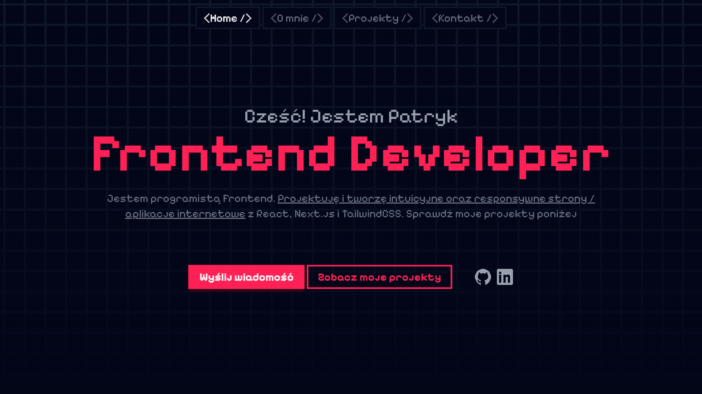

# 👋 My portfolio

This portfolio website shows my skills, experience, and projects as a frontend developer. It is created to present what I can do. The website is responsive, so it works well on different devices. It also includes animations to make the user experience more engaging. The design is built with Tailwind CSS and FlyonUI, focusing on a clean and modern look

The website has an "About Me" section where I describe my background and career. It also includes a list of technologies I use. There is a projects section where I show my work, with short descriptions and the technologies used. There is also a contact form that lets users send me a message. The message is automatically sent to my email, so it is easy to get in touch with me

[**➥ Live**](https://pj-portfolio-cv.vercel.app)

## ⚙️ Technologies

## ⭐ Features

- Animations
- Clean and modern design built with TailwindCSS and FlyonUI
- Send message to me by contact form
- Presentation of information about me
  - About Me section
  - List of technologies I use
  - List of my projects

## 🔎 See Also

[My Website](https://pj-portfolio-cv.vercel.app)  
[My GitHub profile](https://github.com/OKE225)
